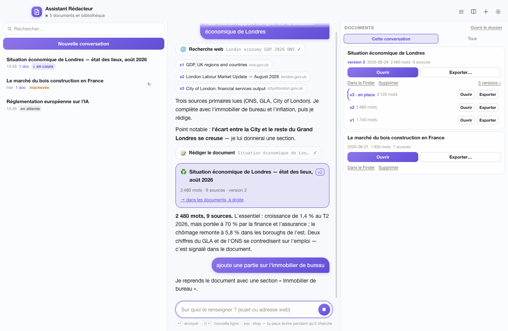
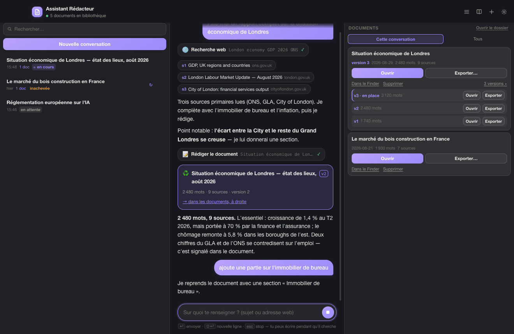

# Assistant Rédacteur — sourced research writer for macOS

A small macOS app that opens a conversational assistant — a Claude Code agent dressed up as a window — with a one-sentence job: **you give it a topic, it returns a detailed, sourced Markdown document.**

Think of it as "Claude Code started in a folder", where the folder is your library: it searches the web, **actually reads** the pages, writes, and saves a `.md` file in `~/Assistant Rédacteur`. Nothing else.

> *Write me a full report on London's economy · Where does EU AI regulation stand? · Briefing note on the timber construction market · Analyse this page: https://…*

The UI and the generated documents are in French by default (English is available in the settings). It runs through the Claude Agent SDK on the Claude Code session already signed in on the machine — no API key to configure in the app.

## Screenshots

*The screenshots replay a scripted demo conversation (`scripts/apercu.mjs`) — no real session or personal data.*





## Install

```bash
npm install
npm run install-app      # builds the app, installs it in /Applications and pins it to the Dock
```

One click opens it, the close button hides it (it stays in the Dock), `⌘Q` quits.

| Shortcut | Action |
|---|---|
| `↩` | send |
| `⇧↩` | new line |
| `esc` | decline the pending card, otherwise interrupt the agent |
| `⌘.` | interrupt the agent |
| `⌘N` | new conversation |
| `⌘L` | show / hide the conversation list |
| `⌘D` | show / hide the documents column |
| `⌘0` | reset the window to a third of the screen |
| `⌘⇧O` | open the library in Finder |

## Several topics in parallel

One document per conversation. `+` opens a new one and reveals the **sidebar**: the list of threads, with a **search** across titles, your requests, the answers, the produced documents and the pages read. Each thread keeps its title (written by the assistant once it understands the request — or set by you with a double-click, which then sticks), its model context and its display: coming back weeks later shows the screen exactly as it was.

Each conversation has **its own session**. Two run at the same time; further requests wait their turn and start automatically (`MAX_EN_PARALLELE` in `src/agent/pool.mjs`). **Navigating never interrupts anything** — switching threads only changes what you look at.

| State in the list | Meaning |
|---|---|
| **en cours** (purple dot) | a search is running in this thread |
| **en attente** | queued, starts as soon as a slot frees up |
| **inachevée** / **interrompue** | the last turn stopped — ↻ to resume |

## Nothing is left hanging

1. **Nothing is cut by accident**: every thread has its own session.
2. **Automatic reconnection**: if Claude Code stops mid-way, the app reattaches the conversation to its context (two attempts) and says so in the thread.
3. **↻ Resume** in one click, without redoing what is done.

The assistant also **publishes a first version early** and enriches it version after version, so an interrupted search always leaves something readable behind.

## How sources are guaranteed

A language model can produce a credible bibliography without reading anything. The app makes that impossible by construction:

1. **`WebFetch` is disabled.** The only way to open a page is the `consulter_source` tool, which downloads it, flattens it and **records it in a registry** (id, title, publisher, publication date, access date).
2. **A deterministic guard** (`src/agent/gardes.mjs`) inspects every document before saving. Any `http(s)` address in the text that is not in the registry makes the call **fail**, listing the culprits.
3. **The bibliography is not written by the model.** It passes ids (`s1`, `s4`…) and the app composes the "Sources" section from the registry.
4. A page that returned **nothing** (paywall, JavaScript-only site) doesn't count as read.
5. Citing only readings from previous conversations is refused too.

Cross-checking contradictory figures, preferring primary sources and flagging stale data are handled by the instructions (`src/agent/prompt.mjs`).

## Three columns

The window takes **a third of the screen**, split into three equal, resizable columns: conversations (`⌘L`), the thread, and the **documents** with their versions (`⌘D`). A document **never opens by itself**; it appears in the column and belongs to the conversation that wrote it (the **Tous** tab shows the whole library).

## Edit, version, export

"Add a section on office real estate", "section 3 is too long": the assistant **republishes** the document and every republication creates a **new version**. Old versions go to `Versions/<document>/v2.md` — nothing is ever overwritten. Each version can be opened and exported separately, and "go back to the previous version" restores it under a new number. **Exporter…** saves a copy anywhere with the macOS save panel.

## It works on its own

By default the assistant **asks nothing**: it searches, reads, writes, republishes and reports at the end. The writing guards still apply, every tool call is visible in the thread and in the log, and deleting a document moves it to the macOS Trash. The **Autonomie** setting (⚙) switches to a *careful* mode that asks before shell commands, writes outside the library or deletions.

## Documents

One `.md` file per topic in `~/Assistant Rédacteur` (configurable). Nothing proprietary. A document opens on its content — title, summary, table of contents (generated from the actual headings) — and ends with the sources and an "About this document" block; a final HTML comment stores metadata for the app. A "What the sources don't say" section collects gaps, outdated figures and unresolved contradictions.

> Why not `~/Documents`? macOS protects it and asks again for permission whenever the app signature changes. The home folder root isn't watched. You can still point the library to `~/Documents` in the settings.

## Settings

| Setting | Effect |
|---|---|
| **Model** | Opus 5 by default; Sonnet 5 is faster, Haiku 4.5 is brisk |
| **Autonomy** | acts alone (default) · ask before sensitive actions |
| **Depth** | note ~1,000 words / 3–5 sources · document ~2,500 / 6–10 · dossier ~5,000 / 12+ |
| **Language** | French or English |
| **Library** | folder where documents are saved |

## macOS notes

1. **The bundle name has no accent** (`Assistant Redacteur.app`): an accent in the executable path makes Electron crash at launch (`SIGTRAP`). The accented name comes back through `CFBundleDisplayName`.
2. **Stable signature**: `scripts/signature.sh` creates a local self-signed certificate once, so the Keychain "Always allow" granted to Claude Code's credentials survives rebuilds.
3. If the assistant stays silent, open **Conversation ▸ Ouvrir le journal de bord** (startup log and Claude Code stderr).

## Development

```bash
npm start          # run the app from source
npm test           # extraction, guards, library, tools, conversations, sessions, autonomy
npm run selftest   # real agent session: reads a page and writes a document
npm run charge     # heavy request run to completion with automatic resume
npx electron scripts/apercu.mjs   # replay a demo conversation and capture the UI
```

| File | Role |
|---|---|
| `src/main.mjs` | window, settings, IPC, confirmation cards |
| `src/agent/session.mjs` | the Claude Agent SDK loop |
| `src/agent/prompt.mjs` | instructions: method, document shape, tone |
| `src/agent/outils.mjs` | MCP tools (read source, write document, library) |
| `src/agent/gardes.mjs` | deterministic refusals: only cite what was read |
| `src/agent/pool.mjs` | two concurrent sessions, a queue, no interruptions |
| `src/doc/conversations.mjs` | threads: title, search, replayable display |
| `src/doc/journal.mjs` | the log, the only trace when launched from the Dock |
| `src/doc/web.mjs` | page download and flattening |
| `src/doc/sources.mjs` | registry of consulted sources |
| `src/doc/bibliotheque.mjs` | `.md` files: header, body, bibliography |

App data (source registry, source texts, settings) lives in `~/Library/Application Support/Assistant Rédacteur`; documents stay in your library folder.
